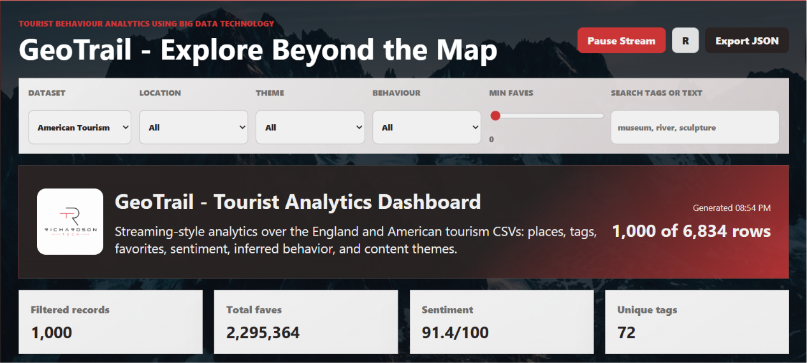
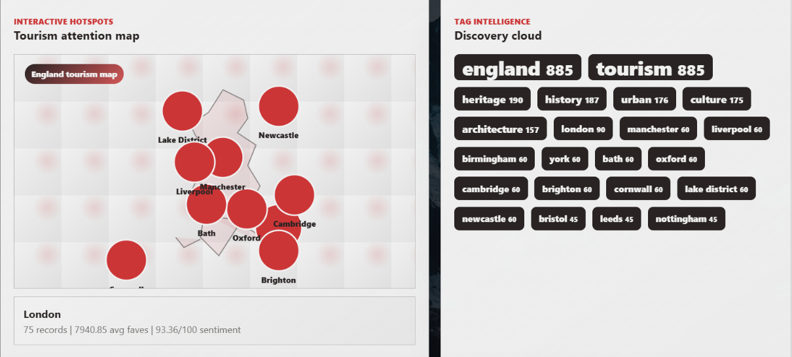
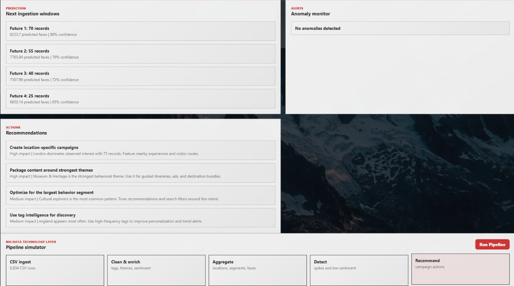
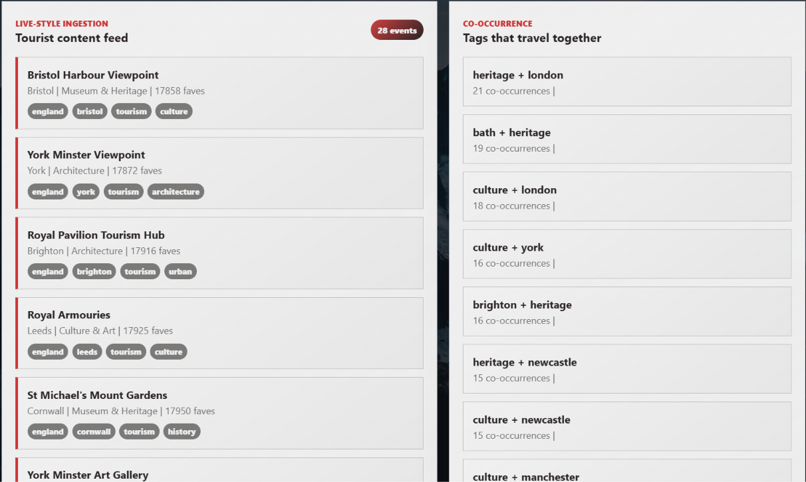
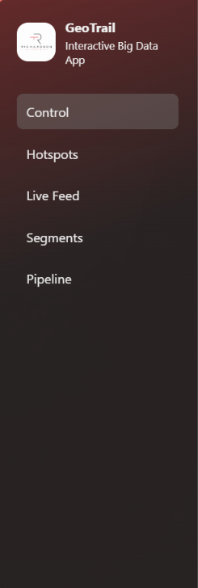
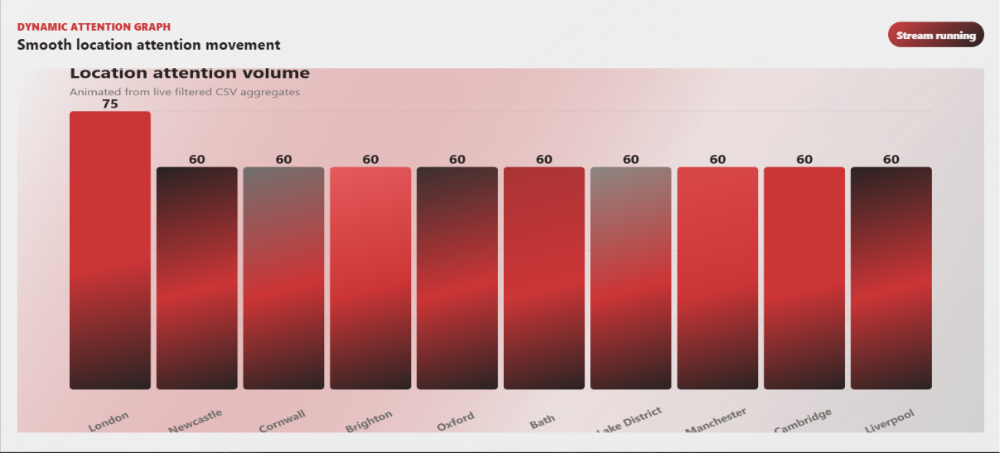

# Analyzing Tourist Behaviour using Big Data Technology

A full-stack tourism analytics app with a modern interactive dashboard UI, backend API, real CSV dataset ingestion, and an analytics pipeline for visitor behavior, content engagement, inferred tourist intent, hotspot detection, segmentation, anomaly detection, and forecasting.

## Features

- Interactive dashboard for tourism content engagement, hotspots, tags, inferred behavior, sentiment, and recommendations.
- Backend API built with Python standard library modules, so no package installation is required.
- Big-data-inspired analytics pipeline with CSV ingestion, enrichment, aggregation, behavioral segmentation, anomaly detection, co-occurrence mining, and forecasting.
- Combined tourism analytics loaded from `data/England Tourism.csv` and `data/American Tourism.csv`.
- App-like interactions: server-side filters, pulsing hotspot map, animated live feed, clickable tag cloud, segment drilldowns, and pipeline simulator.
- Export current analytics as JSON.

## Project Structure

```text
.
+-- data/
|   +-- American Tourism.csv
|   +-- England Tourism.csv
+-- public/
|   +-- app.js
|   +-- index.html
|   +-- styles.css
+-- src/
|   +-- analytics.py
+-- package.json
+-- README.md
+-- server.py
+-- start_geotrail.bat
+-- start_geotrail.ps1
```

## Run Locally

The app now runs on the Python backend in `server.py`. If `python` is on your PATH:

```bash
python server.py
```

Open:

```text
http://localhost:5000
```

If port `5000` is busy:

```powershell
$env:PORT=5000
python server.py
```

If Windows PowerShell cannot find `python`, use the included launcher:

```powershell
.\start_geotrail.bat
```

## API

## Screenshots

### Dashboard Overview


### Tourism Heatmap


### Analytics Pipeline


### Live-Style Ingestion Pipeline


### Navigation Bar


### Dynamic Attention Graph


- Dashboard Overview
- Tourism Hotspot Map
- Forecast Charts
- Analytic Pipeline
- Live-Style Ingestion
- Dynamic Allocation Graph

### Health

```http
GET /api/health
```

### Sample Dataset

```http
GET /api/dataset
```

Returns the sample CSV.

### Default Analytics

```http
GET /api/analytics
```

Runs the Python analytics pipeline over the England and American tourism CSV files together.

Optional query parameters:

```text
location=London
theme=Architecture
behavior=Urban observers
minFaves=10
search=museum
```

## Analytics Pipeline

The pipeline in `src/analytics.py` performs:

- CSV parsing and record normalization.
- Location, theme, sentiment, richness, and behavior inference from titles, descriptions, tags, and favorites.
- Hotspot, theme, behavior, tag, and co-occurrence aggregation.
- Behavioral segmentation:
  - Casual browsers
  - Urban observers
  - Scenic wanderers
  - Cultural explorers
  - High-engagement viewers
  - Landmark seekers
- Future ingestion-window forecast using batch history.
- Engagement spike and low-sentiment anomaly detection.
- Operational recommendations based on hotspots, content themes, behavior mix, and tag intelligence.

You can run the pipeline directly:

```bash
python src/analytics.py "data/England Tourism.csv"
python src/analytics.py "data/American Tourism.csv"
```

## Phone Install

The project is now a PWA-style local web app. Start the Python server, open `http://localhost:5000` on your phone if it can reach your PC, then use your browser's install/add-to-home-screen option. A native APK requires Android SDK/Gradle, which are not included in this workspace.

## Big Data Technology Extension Path

This app is intentionally dependency-free for easy local execution, but the architecture maps cleanly to a production big data stack:

- Replace CSV file ingestion with Kafka, Kinesis, or Pub/Sub event streams.
- Move batch processing into Spark, PySpark, Flink, or Beam.
- Store raw and curated datasets in S3, ADLS, GCS, HDFS, or a lakehouse table format.
- Serve aggregates from ClickHouse, BigQuery, Snowflake, Cassandra, MongoDB, or PostgreSQL.
- Replace the simple trend forecast with Prophet, ARIMA, XGBoost, or an MLflow-managed model.
- Add authentication, dataset governance, and scheduled report generation.
